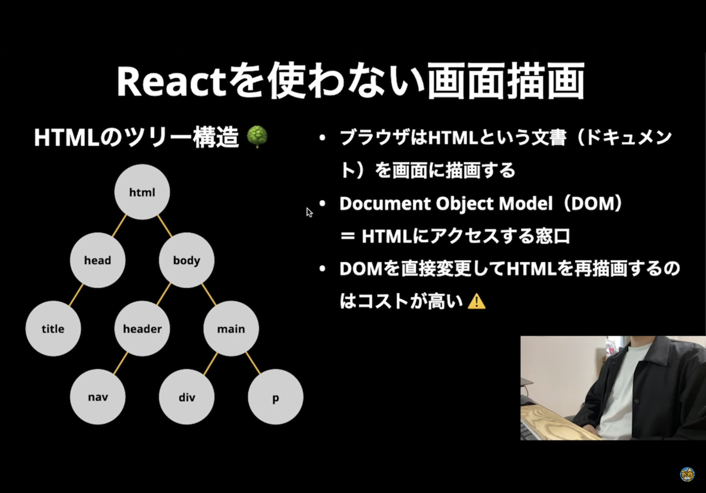
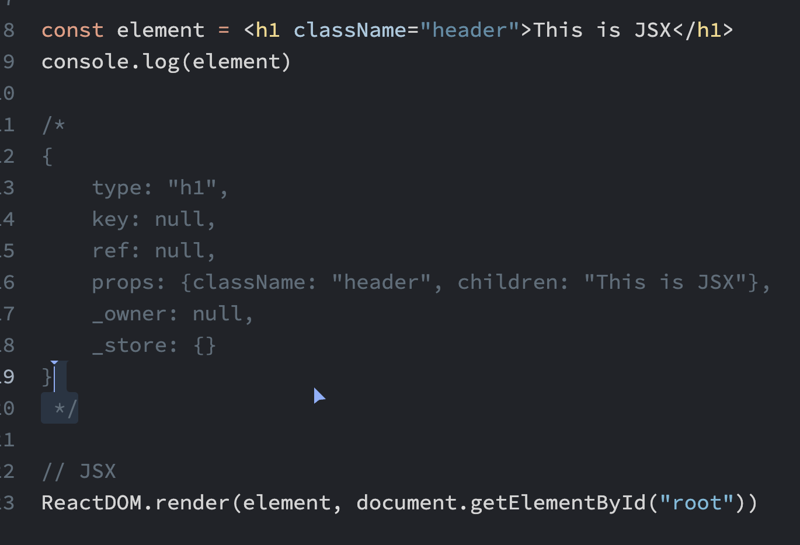
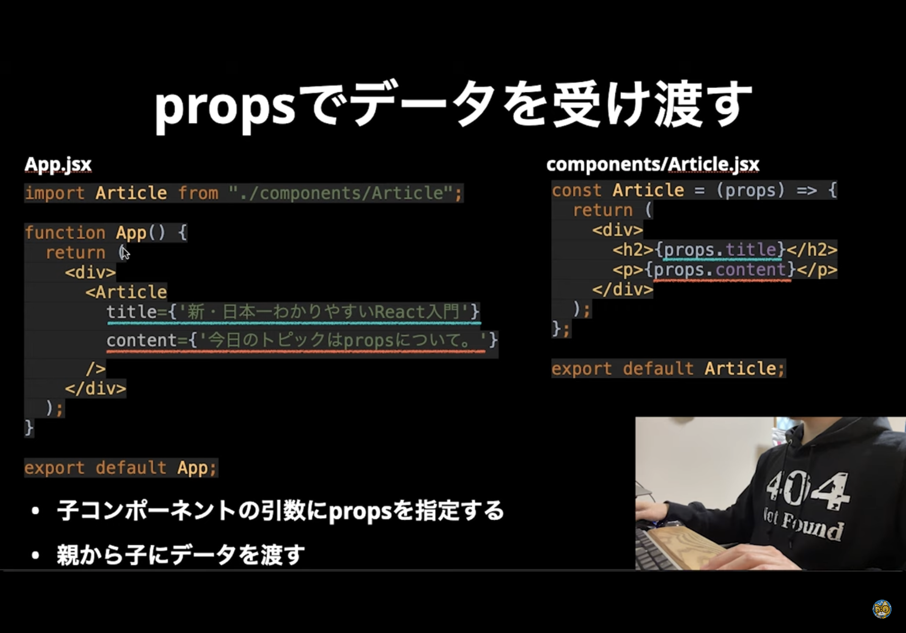

# 新・日本一わかりやすいReact入門[基礎編]
# LearnReact

## Reactの基礎知識

### コンポーネント
見た目＋機能
### 画面描画


DOM直接変更して再描画するとコスト高い

Reactの解決策：仮想DOM
jsオブジェクトとして扱う、効率よくレンダリング（render）する
console.log输出react要素，会得到js对象的形式（如下图）



#### 差分描画
仮想DOM上では、差分があるエレメントのみ再描画する。
最終的に、関連エレメント・子エレメントなども再描画が反映される
DOMの状態をjsで管理するできる


## JSXの記法

### JSXとは
jsの拡張言語　js＋htmlの組み合わせみたいな
最終的にReact要素を生成する
直接React.createElementより、htmlタグみたいな構文（JSX）の方が直感で、書きやすい

### 基礎文法
ファイル拡張子.jsxの方がいい
import React form 'react'; // React18では要らなくなった
{}の中で変数を扱う（jsの領域を意味する）
必ず階層構造のタグをリターンする。並列の多数要素はエラーとなる。
どうしても並列要素をリターンする必要の場合、<React.Fragment></React.Fragment>又は<></>で囲む


## create-react-app
npx create-react-app projectName
### ディレクトリ説明
* src: 開発ファイル　ReactコンポーネントのJSXファイル
* public: htmlや画像ファイル
* build: 本番用ファイル、npm run buildコマンドで生成される

### コマンド
* npm start
    ホットリロードできる（変更内容自動反映される）
* npm run build
    本番に使う
* npm run eject
    Babel/webPack変更する場合実行（あんまり実行しない方がいい）


## コンポーネント

* Class Component　
    jsのclassみたいに、thisを扱うする。今あんまり使用しない
* Function Component （関数コンポーネント）
    記述量は少ない　パラメータを扱う

Component首字母一定要大写
react组件内class写法：className=""


### なぜコンポーネント？
* 再利用するため
* １コンポーネント１ファイル　見通しをよくする
* 変更しやすい、１箇所だけ修正すればok

### 使い方
* 子コンポーネントでexport default 関数名
* 親コンポーネントが子コンポーネントをimportする
* データ渡し：props（親→子）


## import/exportについて
ES6文法です
* default export（名前なし）推奨
* default import 
    import name form 'path'
* 名前付きimport
    import {多数モジュールの名前} form 'エントリポイントのファイル'

## State

const [state, setState] = useState(initialState)
setState(newState)
state変わった時点でコンポーネント再描画が行う

### {}で変数を渡す

```
function MyComponent ({attr1, attr2, attr3}) {
    //変数を扱う
}
```
{}の中で、propsの属性名を使って、必要な属性だけを受け取る
属性の名前を変更しないこと！

### {}でデータのオブジェクトを渡す
コンポーネントへpropsを渡す時、データをオブジェクトにまとめて渡すのが便利
下記表現で、
オブジェクトを展開し、各属性を渡す。
わざわざ１つずつの属性名を記入する必要なし。
`{...item}`

コンポーネント内データを使う時は下記表現：
`props.item.xxxxx`


### propsへ関数を渡す
渡す時実行しないように
* onClick={funcName}
* onClick={()=>funcName()}


### 条件付きrender
例：
`{props.setup && <h3>Setup: {props.setup}</h3>}`

setup属性が存在する場合のみ、＆＆の右側のエレメントをrenderする

### map render

`Array.map(function(item){return newItem})`

mapの入力引数はコールバック関数である
その関数の入力引数は、arrayのitem
戻り値は、map後の新しいarrayに、itemと同じ位置にあるnewItemになります

mapを使って、arrayデータをコンポーネントに転換する。
それから{array}を使って、コンポーネントのarrayをrenderする。

mapでデータをフォーマットする時、
ユニークな属性（idなど）を一つkey属性として指定する必要がある。